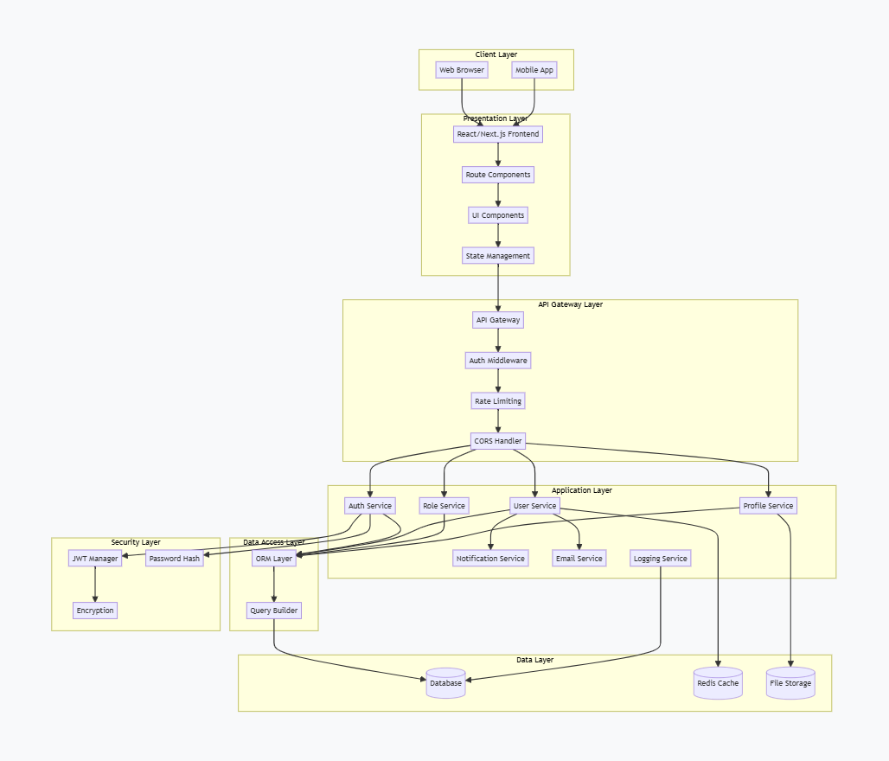
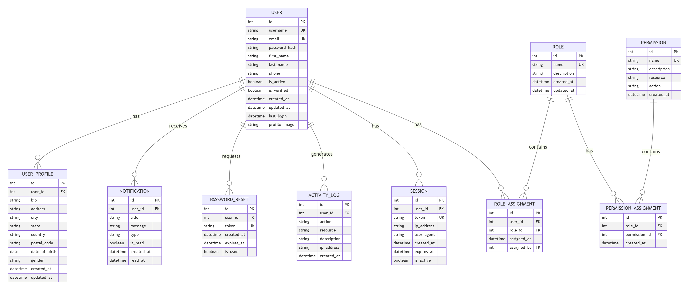

**User Management System**

The **User Management System** is a full-featured web application built using **React (Vite)** for the frontend and a secure REST API backend. It enables administrators and managers to efficiently manage users, roles, permissions, and authentication workflows.

This project follows industry-standard development practices including **JWT-based authentication**, **role-based access control (RBAC)**, **form validation**, and a scalable component structure. It is designed for real-world use cases such as admin dashboards, enterprise-level user management, and secure multi-role systems.

**Key Features**:

**User Authentication**

  * Register, Login, Logout
  * Secure JWT token handling
  * Password hashing and validation
  * Password reset & email recovery flow

**Role-Based Access Control (RBAC)**

  * Create, update, delete roles
  * Assign roles to users
  * Permission-driven access validation

**User Management**

  * View all users (Admin)
  * View individual user details
  * Update or delete users
  * Manage user profiles

**Security Features**

  * Encrypted passwords
  * JWT authentication & session handling
  * Protected API routes
  * Input validation and sanitization

**UI & UX**

  * Responsive and clean UI
  * React components with Tailwind CSS
  * Toasts, dialogs, modals, and validation messages

**Developer Friendly**

  * Clean folder structure
  * Reusable components
  * Centralized state & API integration
  * Error handling and logging

**Tech Stack**:

**Frontend**

* React (Vite)
* React Router DOM
* Tailwind CSS
* Radix UI Components
* React Hook Form + Zod
* Framer Motion
* Lucide Icons

**Backend**

* REST API (Node/Express or Supabase)
* JWT Authentication
* Database with ER model (Users, Roles, Permissions)
* Middleware-based security

**Tools & Libraries**:

* Supabase for authentication/storage
* Postman for API testing
* GitHub for version control
* Render for deployment

**Live Demo**:
https://user-management-system-3-72hk.onrender.com

**API Documentation**
**Postman Collection:**
https://renuka-8275266.postman.co/workspace/Renuka's-Workspace~1e1e8271-f642-46ad-8587-c7ad2cbac581/collection/45703445-e2ffca04-314f-4114-a524-5e0a5c564414?action=share&creator=45703445

**ER & Architecture Diagrams**
Attached in the repository:
## Architecture Diagram

## ER Diagram

These diagrams explain:

* User, Role, Permission relationships
* Authentication & session flow
* System-level architecture with frontend, backend, database

**Deployment**

This project is deployed on Render.

**Build Command**
npm install && npm run build

**Start Command**
npm run dev

**Future Enhancements**
* Two-Factor Authentication (2FA)
* OAuth (Google/GitHub login)
* Export user data to CSV/PDF
* Real-time notifications (WebSockets)
* Admin analytics dashboard

